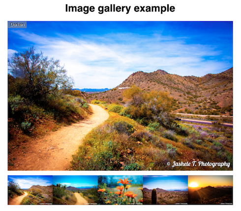
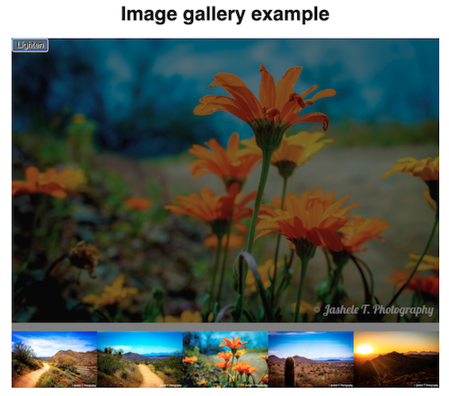

# Image Gallery Assessment
To test comprehension of JavaScript loops, functions, conditionals, and events. 

 

## Demo

 

https://jasheloper.github.io/js-image-gallery/

 

## About

You have been provided with some HTML, CSS and image assets and a few lines of JavaScript code; you need to write the necessary JavaScript to turn this into a working program. 

 

**Link to assessment + steps to complete:**

https://developer.mozilla.org/en-US/docs/Learn/JavaScript/Building_blocks/Image_gallery